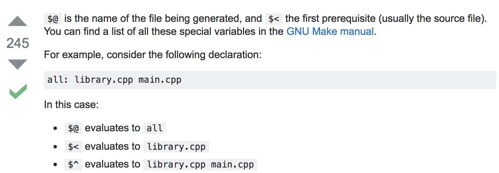

# os
Repository to accompany me along me OS journey. This repo consists primarily of C code that ranges from the
creation of basic kernel modules to code that utilizes POSIX system calls.

Random things learned:

 - A good way to view the default include path for gcc is `echo | gcc -E -Wp,-v -x c -`
   - `-E` only runs the C preprocessor
   - `-Wp,option` flag passes `option` directly to the preprocessor, bypassing the compiler driver. Here `-v` indicates verbose
   - `-` indicates the input will be coming from stdin
   - `-x c` indicates the "C" language; this is good to do since we're accepting input from stdin
 - Finding the full path of some included header can be done with `echo "#include <someHeader.h>" | gcc -E -x c -| grep /someHeader.h`
 - System calls are found in the second section of the man pages, and therefore can be accessed via `man 2 <systemCallhere>`
 - Wow I finally learned the UNIX filesystem permission model!
 - Makefile rule/target stuff: 
 - CTRL+v in insert mode in vim inserts a literal copy of the next character (https://stackoverflow.com/a/4781099/3947332)
